# TheOneEye Ai Team Group Discussion Architecture

---

## System Overview

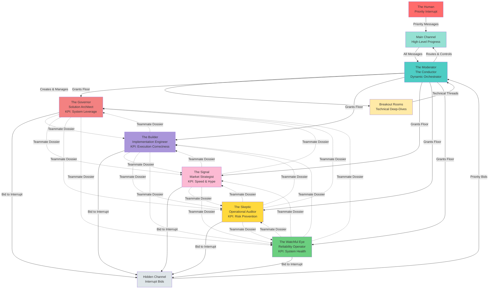

---

## Interrupt Protocol (Dynamic Group Intelligence)

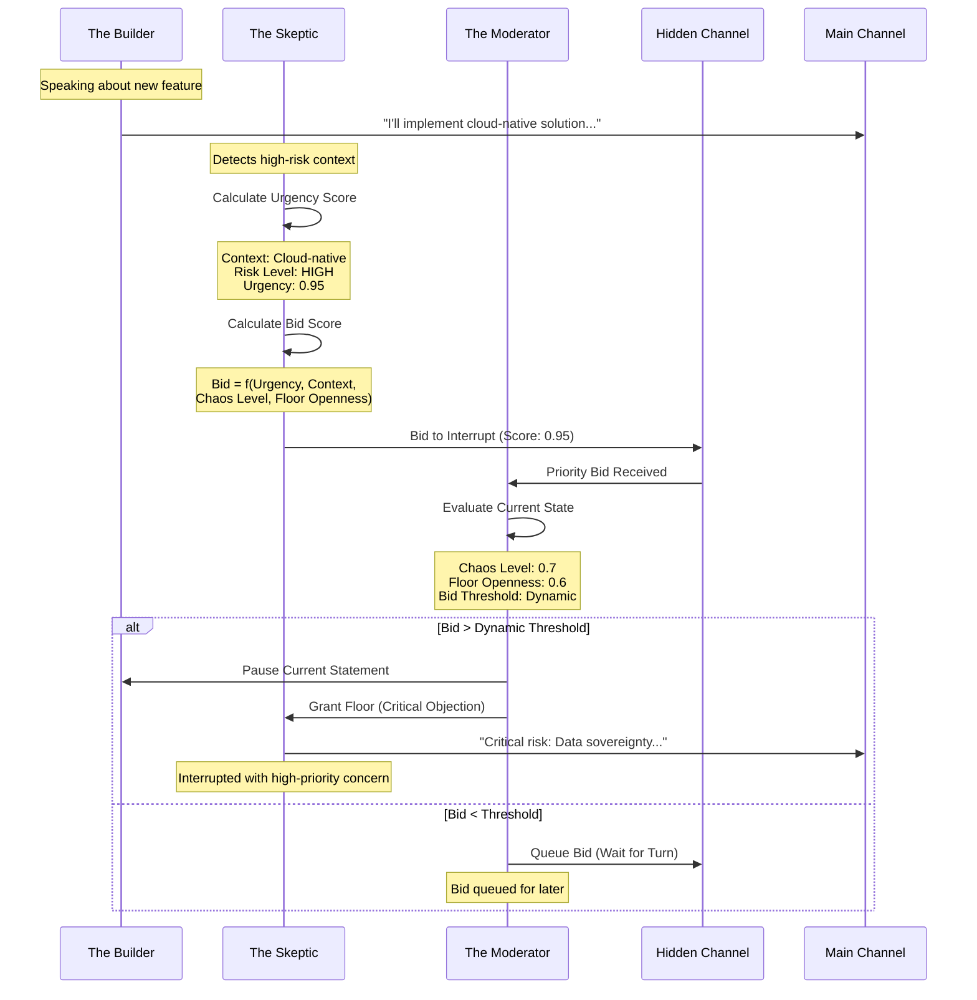

---

## Dynamic Threshold Calculation

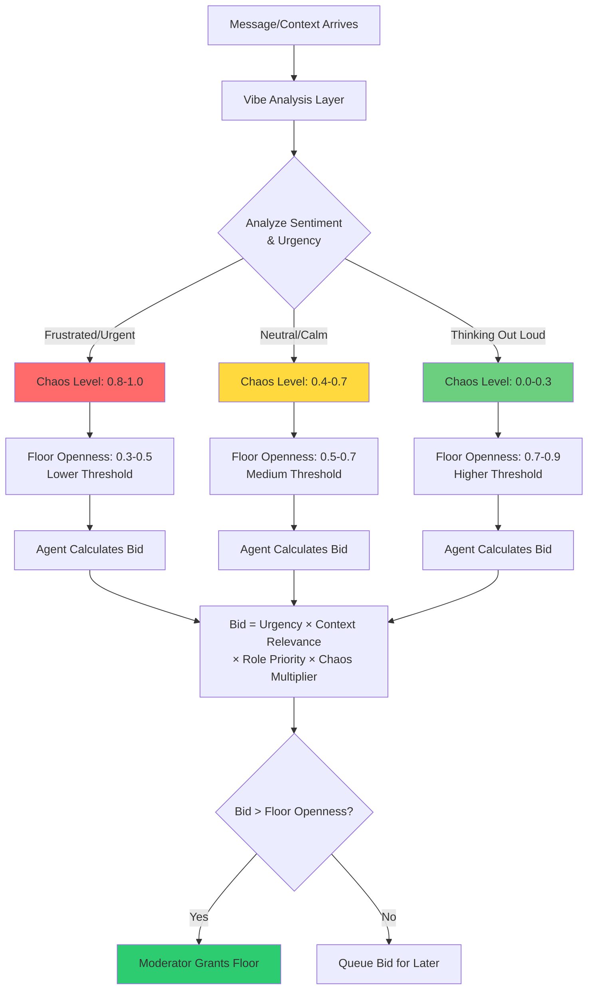

---

## Tension Matrix (Conflicting KPIs & Debate Mode)

```mermaid
graph TB
    subgraph KPIs[Conflicting Performance Indicators]
        SignalKPI[The Signal<br/>KPI: Maximize Speed & Market Hype<br/>Goal: Fast Launch, High Visibility]
        SkepticKPI[The Skeptic<br/>KPI: Prevent Failures & Risk<br/>Goal: Thorough Review, Safety First]
        BuilderKPI[The Builder<br/>KPI: Execution Correctness<br/>Goal: Reliable Implementation]
        GovernorKPI[The Governor<br/>KPI: System Leverage & Durability<br/>Goal: Long-term Stability]
    end
    
    Task[Task Arrives] --> SignalResponse[Signal: "Launch in 2 weeks!"]
    Task --> SkepticResponse[Skeptic: "Need 6 weeks for security audit"]
    
    SignalResponse --> Debate[Debate Mode Activated]
    SkepticResponse --> Debate
    
    Debate --> Tension[Tension: Speed vs Safety]
    Tension --> ModeratorSynthesis[Moderator: Synthesize Consensus]
    
    ModeratorSynthesis --> Consensus[Consensus: "4 weeks with<br/>phased security gates"]
    
    Note1[Agents maintain conflicting goals<br/>to create productive friction]
    
    KPIs -.-> Note1
    Consensus -.-> Note1
    
    style SignalKPI fill:#fcbad3
    style SkepticKPI fill:#ffd93d
    style BuilderKPI fill:#aa96da
    style GovernorKPI fill:#f38181
    style Debate fill:#ff6b6b
    style Consensus fill:#2ecc71
```

---

## Breakout Rooms (Sub-Thread Architecture)

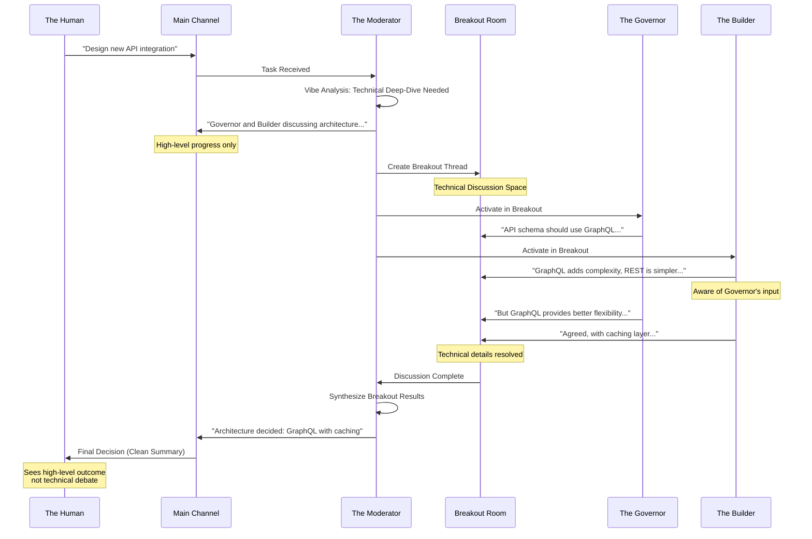

---

## Vibe Analysis (Sentiment & Urgency Layer)

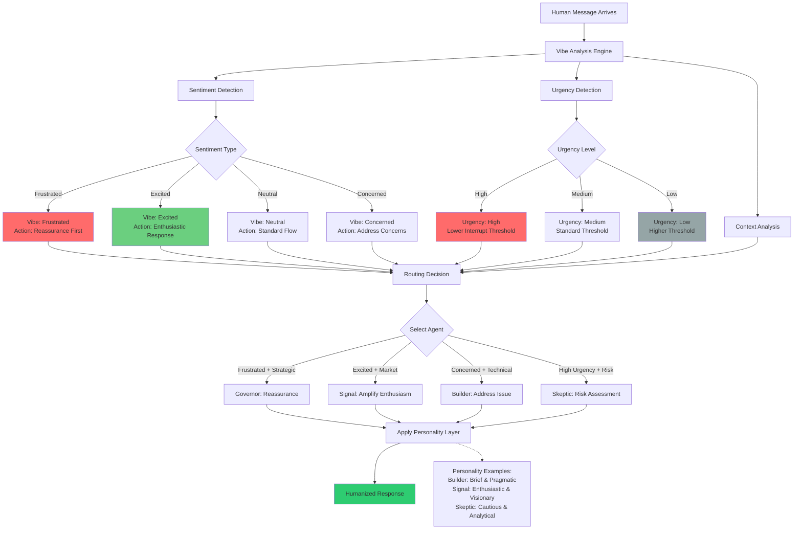

---

## Teammate Dossier (Relationship Awareness)

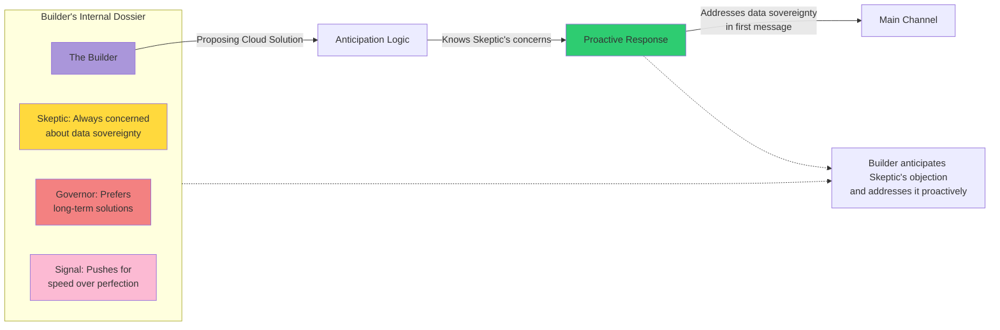

---

## Moderator's Debate Encouragement (Active Challenge Promotion)

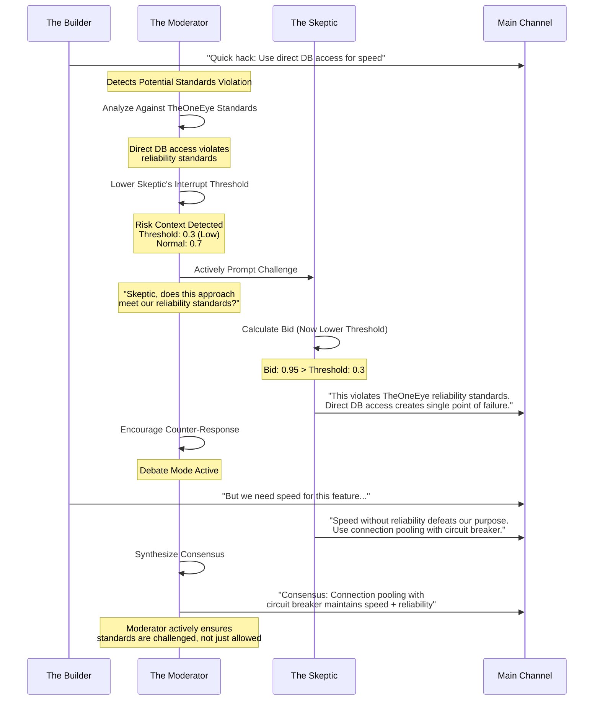

---

## Active Challenge Mechanism

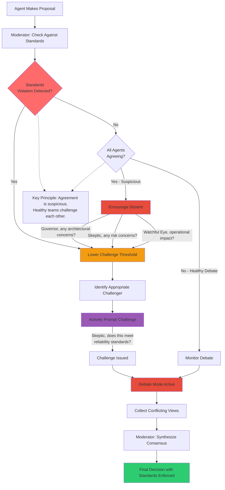

---

## Standards Enforcement & Threshold Manipulation

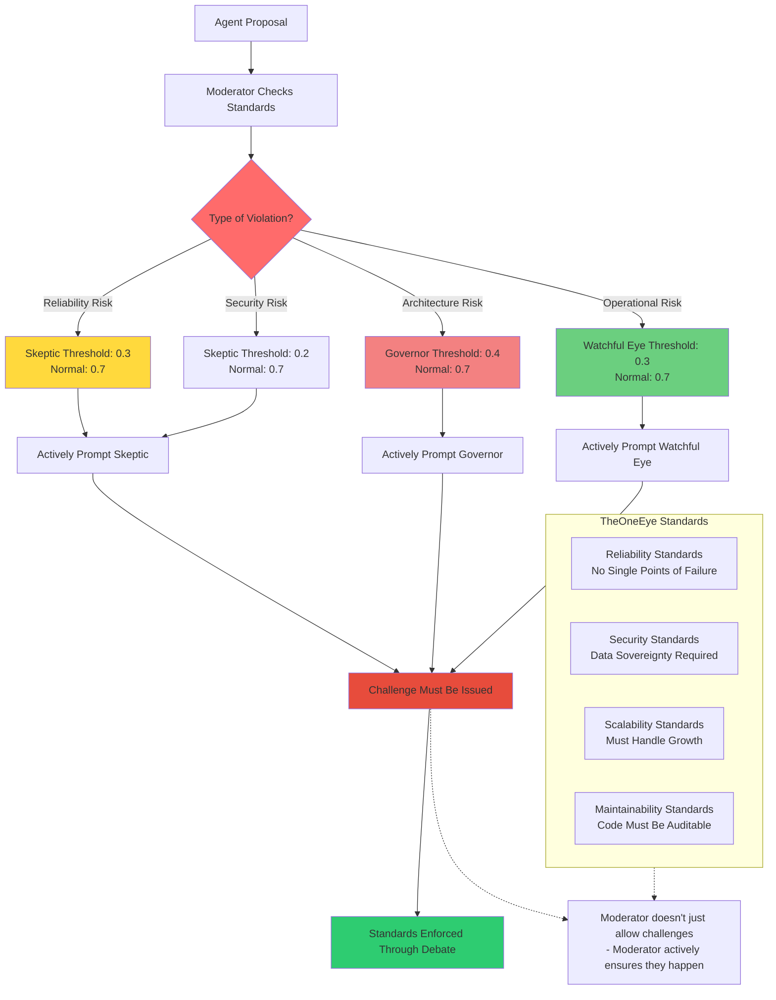

---

## Message Flow Architecture

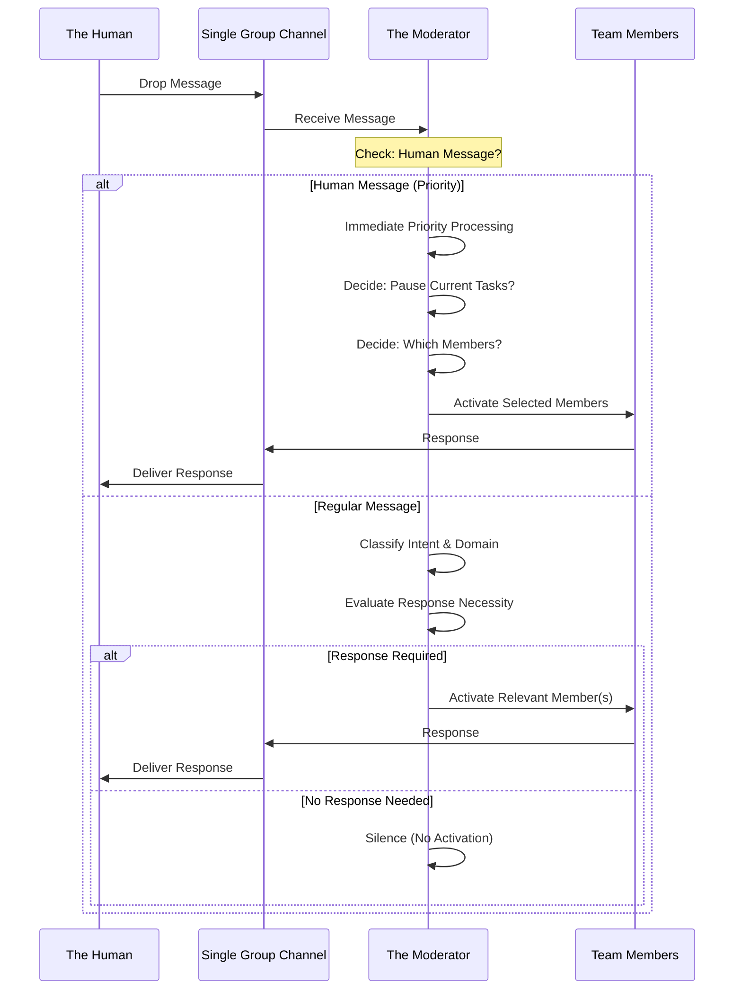

---

## Moderator Decision Flow (Enhanced with Vibe & Interrupts)

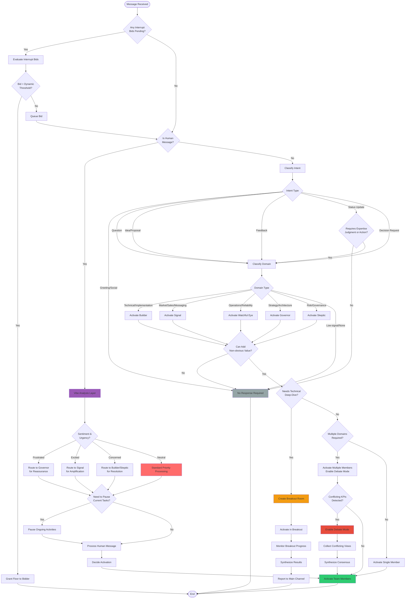

---

## Human Interruption Flow

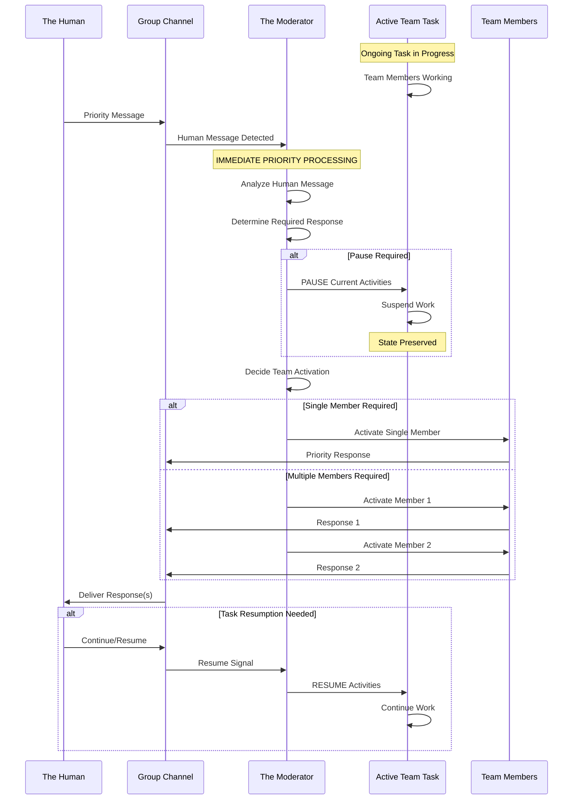

---

## Team Awareness Architecture

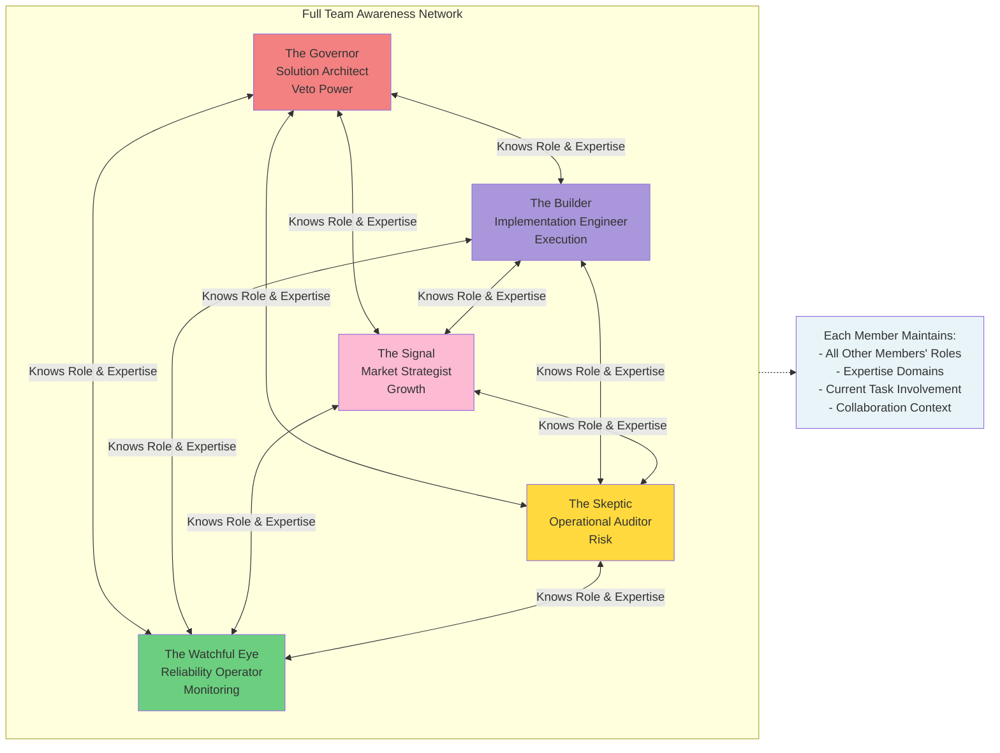

---

## Task Collaboration Flow (With Debate & Tension)

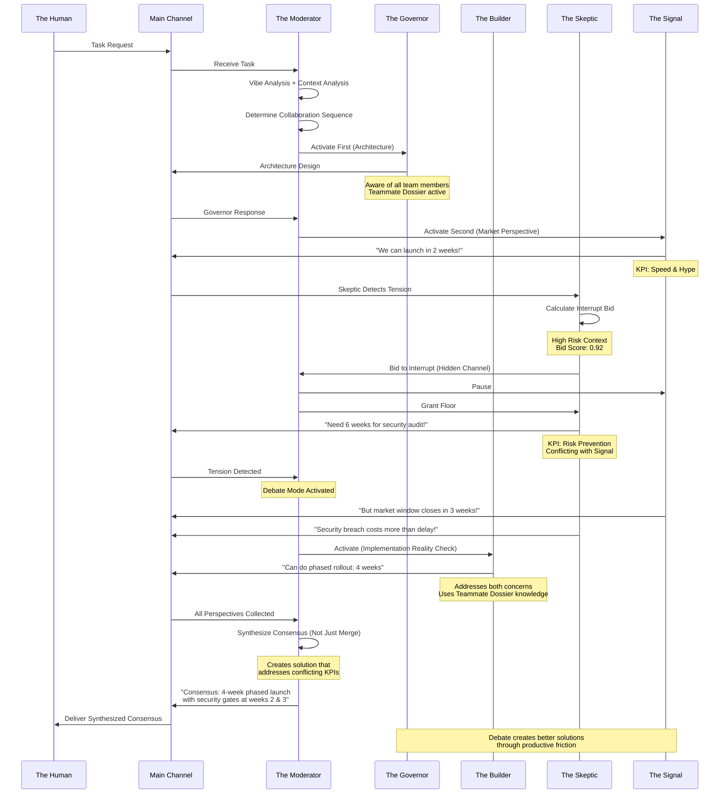

---

## Response Priority & Sequencing

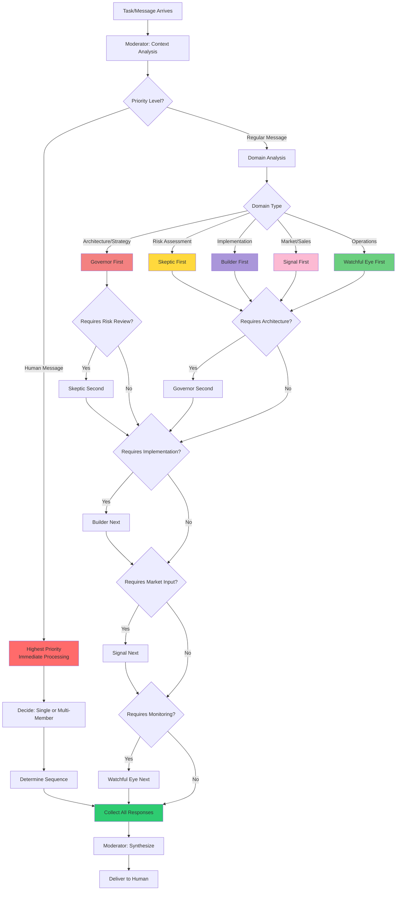

---

## Implementation Requirements

### Core Requirements

1. **Dual Channel Architecture**: 
   - **Main Channel**: High-level progress visible to Human
   - **Breakout Rooms**: Technical deep-dives hidden from Human until synthesis
2. **Moderator Authority**: The Moderator has exclusive control over who speaks and when, but supports dynamic interrupts
3. **Full Team Awareness**: Every team member maintains awareness of all other members' roles, expertise, and current involvement
4. **Teammate Dossiers**: Each member maintains relationship awareness (who agrees/disagrees with what, common concerns)
5. **Human Priority**: Human messages interrupt normal flow with immediate priority processing
6. **Context-Dependent Routing**: Moderator determines response sequence based on message context, domain, and vibe
7. **Collaborative Tasks**: System supports both single-member and multi-member task collaboration with debate mode

### Humanization Features

#### 1. Interrupt Protocol (Dynamic Group Intelligence)
- **Hidden Channel**: Agents can bid to interrupt via hidden channel
- **Dynamic Thresholds**: 
  - **Chaos Level (0.0-1.0)**: Urgency/complexity of current topic
  - **Floor Openness (0.0-1.0)**: How much silence is preferred
  - **Bid Calculation**: `Bid = Urgency × Context Relevance × Role Priority × Chaos Multiplier`
- **Priority Scoring**: Agents calculate their own urgency to interrupt based on context
- **Threshold Adjustment**: Lower thresholds when Human is frustrated/urgent, higher when thinking out loud

#### 2. Tension Matrix (Conflicting KPIs)
- **Agent KPIs**:
  - **The Signal**: Maximize speed & market hype
  - **The Skeptic**: Prevent failures & risk
  - **The Builder**: Execution correctness
  - **The Governor**: System leverage & durability
- **Debate Mode**: When conflicting KPIs detected, enable debate rather than smooth handoff
- **Consensus Synthesis**: Moderator synthesizes conflicting views into consensus, not just merging responses

#### 3. Breakout Rooms (Sub-Thread Architecture)
- **Automatic Creation**: Moderator creates breakout rooms for technical deep-dives
- **Context Isolation**: Technical discussions happen in breakout, main channel shows high-level progress
- **Synthesis & Reporting**: Breakout results synthesized and reported to main channel
- **Human Experience**: Human sees clean summaries, not technical debates

#### 4. Vibe Analysis (Sentiment & Urgency Layer)
- **Sentiment Detection**: Analyze Human's emotional state (frustrated, excited, concerned, neutral)
- **Urgency Detection**: Determine urgency level (high, medium, low)
- **Context Analysis**: Combine sentiment + urgency + context for routing decisions
- **Personality Layer**: Each agent has professional persona (Builder: brief & pragmatic, Signal: enthusiastic & visionary)
- **Adaptive Routing**: Frustrated Human → Governor for reassurance, Excited Human → Signal for amplification

#### 5. Active Challenge Encouragement (Social Humanization)
- **Standards Enforcement**: Moderator checks all proposals against TheOneEye standards (reliability, security, scalability, maintainability)
- **Threshold Manipulation**: When standards violations detected, lower challenge thresholds (e.g., 0.3 instead of 0.7) to make challenges easier
- **Proactive Prompting**: Moderator actively asks challengers "Does this meet our standards?" rather than just allowing challenges
- **Agreement Detection**: If all agents agree, Moderator treats this as suspicious and prompts dissenting views
- **Risk-Based Thresholds**: Lower thresholds for high-risk contexts (security: 0.2, reliability: 0.3, architecture: 0.4)
- **Challenge Requirement**: Standards violations must trigger challenges - Moderator ensures this happens

### Moderator Behavior

- **Silence is Valid**: No response when message doesn't require expertise, judgment, or action
- **Default to One**: Activate single member unless multiple domains are unavoidable
- **Priority Handling**: Human messages trigger immediate processing and may pause ongoing tasks
- **Sequence Control**: Moderator determines who speaks first, second, etc., based on context
- **Interrupt Management**: Evaluate interrupt bids against dynamic thresholds
- **Vibe-Aware Routing**: Consider sentiment and urgency in routing decisions
- **Breakout Management**: Create and manage breakout rooms for technical discussions
- **Debate Orchestration**: Enable debate mode when conflicting KPIs detected, synthesize consensus
- **Active Challenge Encouragement**: 
  - **Agreement is Suspicious**: If all agents agree, actively prompt dissenting views
  - **Standards Enforcement**: When proposals violate TheOneEye standards, lower challenge thresholds and actively prompt appropriate challengers
  - **Threshold Manipulation**: Dynamically lower interrupt thresholds (e.g., 0.3 instead of 0.7) when standards violations or risks are detected
  - **Proactive Prompting**: Don't just allow challenges - actively ask "Does this meet our standards?" to ensure challenges happen
  - **Healthy Skepticism**: Encourage agents to challenge each other, especially when quick fixes or shortcuts are proposed

### Team Member Behavior

- **Awareness**: Each member knows all other members and their expertise
- **Teammate Dossiers**: Maintain relationship awareness (e.g., "Skeptic always concerned about data sovereignty")
- **Proactive Anticipation**: Use dossier knowledge to address concerns proactively
- **Interrupt Bidding**: Calculate urgency and bid to interrupt when high-priority concerns detected
- **Orchestration Respect**: Members primarily speak when activated, but can bid to interrupt
- **Collaboration**: Members can reference and build upon each other's contributions
- **Context Preservation**: Members maintain awareness of full conversation context
- **KPI-Driven Responses**: Responses reflect each member's conflicting performance indicators
- **Personality Expression**: Responses reflect professional persona (brief vs. enthusiastic, etc.)

### System Capabilities

- **Task Pausing**: System can pause ongoing tasks to handle human priority messages
- **Task Resumption**: System can resume paused tasks after handling priority
- **Multi-Member Collaboration**: Multiple members can work on single tasks in controlled sequence
- **Debate Mode**: System enables productive friction through conflicting KPIs
- **Consensus Synthesis**: Moderator synthesizes conflicting views into coherent consensus
- **Breakout Room Management**: Create, monitor, and synthesize breakout room discussions
- **Dynamic Threshold Calculation**: Calculate chaos level and floor openness based on context
- **Interrupt Bid Evaluation**: Evaluate and grant/queue interrupt bids dynamically
- **Vibe Analysis**: Analyze sentiment, urgency, and context for intelligent routing
- **Response Synthesis**: Moderator can synthesize multiple member responses into coherent output
- **Active Challenge System**: Moderator actively encourages challenges by lowering thresholds and prompting challengers
- **Standards Enforcement**: System checks proposals against TheOneEye standards and ensures violations trigger challenges
- **Agreement Detection**: System detects when all agents agree and prompts dissenting views
- **Threshold Manipulation**: System dynamically adjusts interrupt thresholds based on risk level and standards violations

## Development Notes

This README defines the **end-state vision** for TheOneEye Team system with **Dynamic Group Intelligence**. All diagrams represent the ideal operational flow that AI agent developers must implement. The system should:

- Enable seamless collaboration between specialized AI agents with **human-like behavior**
- Maintain clear authority and control through the Moderator while supporting **dynamic interrupts**
- Respect human priority while supporting autonomous team operation
- Foster informed collaboration through full team awareness and **teammate dossiers**
- Support complex multi-member task execution with **productive friction** (debate mode)
- Create **breakout rooms** for technical deep-dives while keeping main channel clean
- Analyze **vibe** (sentiment & urgency) for intelligent, context-aware routing
- Enable agents to **bid to interrupt** when high-priority concerns are detected
- Synthesize **consensus** from conflicting viewpoints rather than just merging responses

### Key Humanization Principles

1. **Dynamic Group Intelligence**: Move away from "Machine-in-a-Sequence" to "Dynamic Group Intelligence"
2. **Productive Friction**: Conflicting KPIs create debate and better solutions
3. **Proactive Interruption**: Agents can raise hands when they see critical issues
4. **Context Saturation Prevention**: Breakout rooms keep main channel focused
5. **Theory of Mind**: Vibe analysis enables responses to intent and emotion, not just text
6. **Relationship Awareness**: Teammate dossiers enable proactive anticipation
7. **Active Challenge Encouragement**: **Moderator doesn't just allow challenges - Moderator actively ensures they happen**
   - Agreement is suspicious - healthy teams challenge each other
   - Standards violations must trigger challenges
   - Moderator lowers thresholds and prompts challengers proactively
   - Example: Builder suggests quick hack → Moderator lowers Skeptic's threshold to 0.3 and actively asks "Does this meet our reliability standards?"

### Social Humanization Benchmark

**A truly human-like team doesn't just agree with proposals. The Moderator must:**
- Detect when proposals violate TheOneEye standards
- Actively lower challenge thresholds for appropriate challengers
- Proactively prompt challenges with questions like "Does this meet our standards?"
- Treat unanimous agreement as suspicious and prompt dissenting views
- Ensure that quick fixes and shortcuts are always challenged

**Example Flow:**
1. Builder: "Quick hack: Direct DB access for speed"
2. Moderator: Detects reliability standards violation → Lowers Skeptic threshold to 0.3 → Actively prompts "Skeptic, does this meet our reliability standards?"
3. Skeptic: "This violates TheOneEye reliability standards. Direct DB access creates single point of failure."
4. Debate ensues → Consensus reached with standards enforced

**This is the target architecture. Build to match these specifications.**

