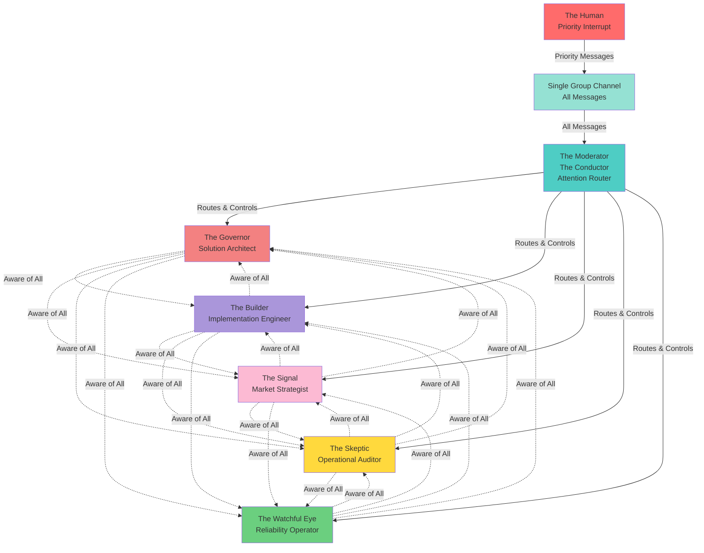
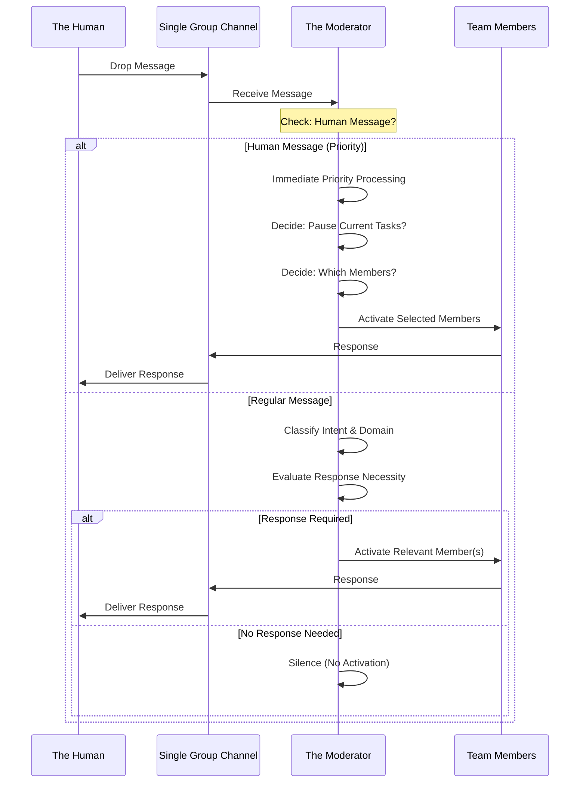
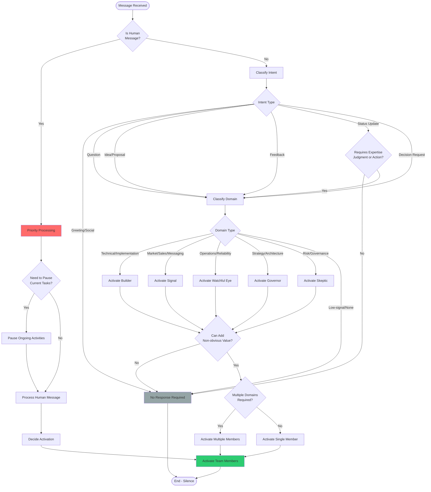
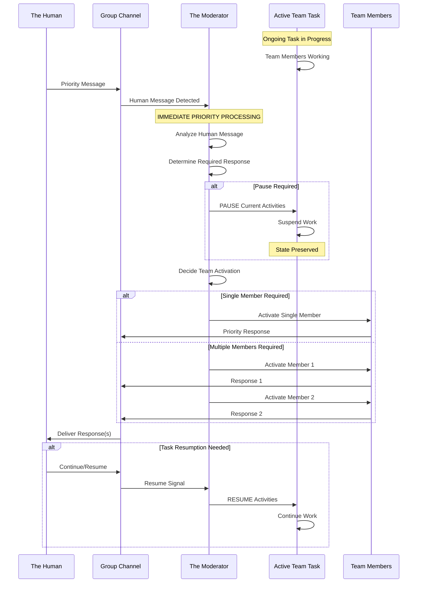
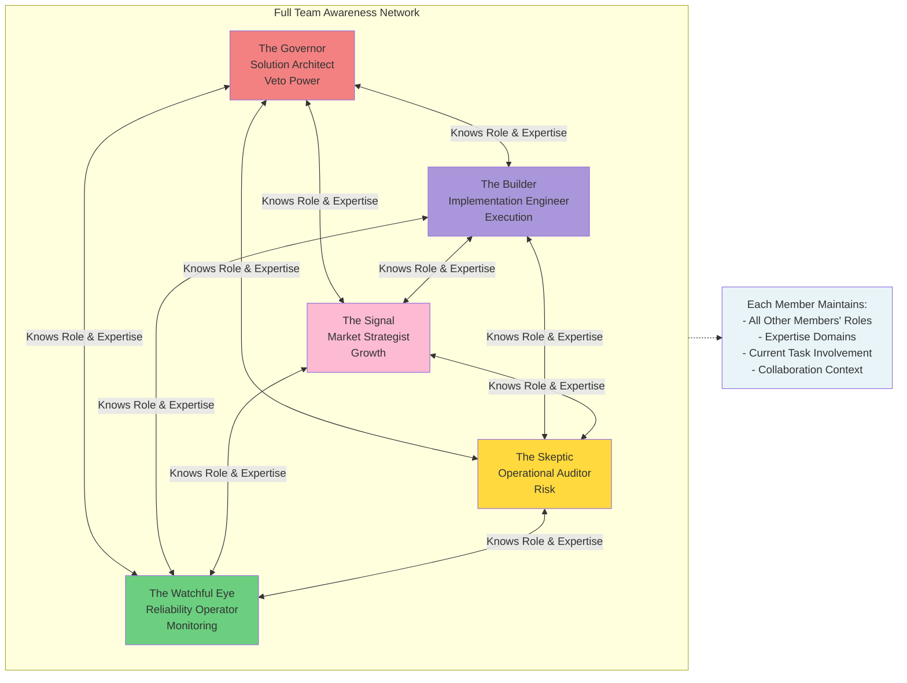
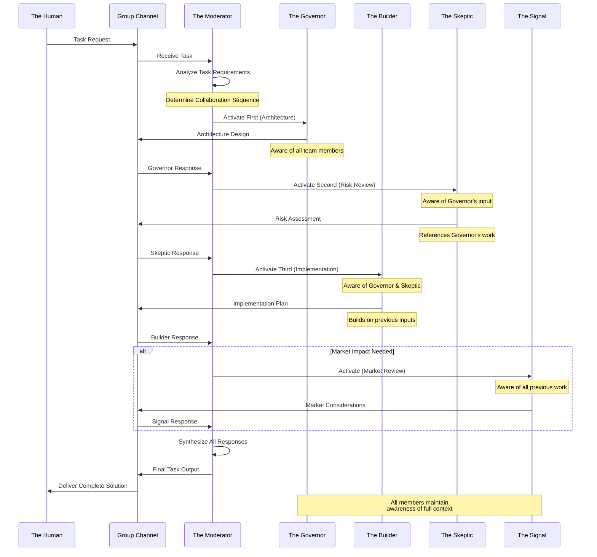
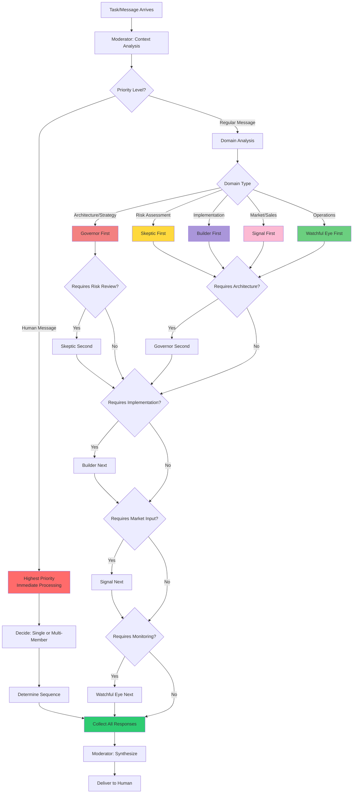

# TheOneEye Team Architecture

> **Purpose**: This document defines the end-state vision for TheOneEye AI Team system. It serves as the requirements specification for AI agent developers to design and implement the collaborative team architecture.

---

## System Overview



---

## Message Flow Architecture



---

## Moderator Decision Flow



---

## Human Interruption Flow



---

## Team Awareness Architecture



---

## Task Collaboration Flow



---

## Response Priority & Sequencing



---

## Implementation Requirements

### Core Requirements

1. **Single Group Channel**: All messages (human and system) flow through one communication channel
2. **Moderator Authority**: The Moderator has exclusive control over who speaks and when
3. **Full Team Awareness**: Every team member maintains awareness of all other members' roles, expertise, and current involvement
4. **Human Priority**: Human messages interrupt normal flow with immediate priority processing
5. **Context-Dependent Routing**: Moderator determines response sequence based on message context and domain
6. **Collaborative Tasks**: System supports both single-member and multi-member task collaboration

### Moderator Behavior

- **Silence is Valid**: No response when message doesn't require expertise, judgment, or action
- **Default to One**: Activate single member unless multiple domains are unavoidable
- **Priority Handling**: Human messages trigger immediate processing and may pause ongoing tasks
- **Sequence Control**: Moderator determines who speaks first, second, etc., based on context

### Team Member Behavior

- **Awareness**: Each member knows all other members and their expertise
- **Orchestration Respect**: Members only speak when activated by Moderator
- **Collaboration**: Members can reference and build upon each other's contributions
- **Context Preservation**: Members maintain awareness of full conversation context

### System Capabilities

- **Task Pausing**: System can pause ongoing tasks to handle human priority messages
- **Task Resumption**: System can resume paused tasks after handling priority
- **Multi-Member Collaboration**: Multiple members can work on single tasks in controlled sequence
- **Response Synthesis**: Moderator can synthesize multiple member responses into coherent output

---

## File Structure

```
TheOneEyeTeam/
├── README.md                    # This file (System Architecture & Requirements)
├── Moderator.md                 # Moderator persona definition
└── TeamMembers/
    ├── The Solution Architect (The Governor).md
    ├── The Implementation Engineer (The Builder).md
    ├── The Market Strategist (The Signal).md
    ├── The Operational Auditor (The Skeptic).md
    └── The Reliability Operator (The Watchful Eye).md
```

---

## Development Notes

This README defines the **end-state vision** for TheOneEye Team system. All diagrams represent the ideal operational flow that AI agent developers must implement. The system should:

- Enable seamless collaboration between specialized AI agents
- Maintain clear authority and control through the Moderator
- Respect human priority while supporting autonomous team operation
- Foster informed collaboration through full team awareness
- Support complex multi-member task execution with proper sequencing

**This is the target architecture. Build to match these specifications.**

