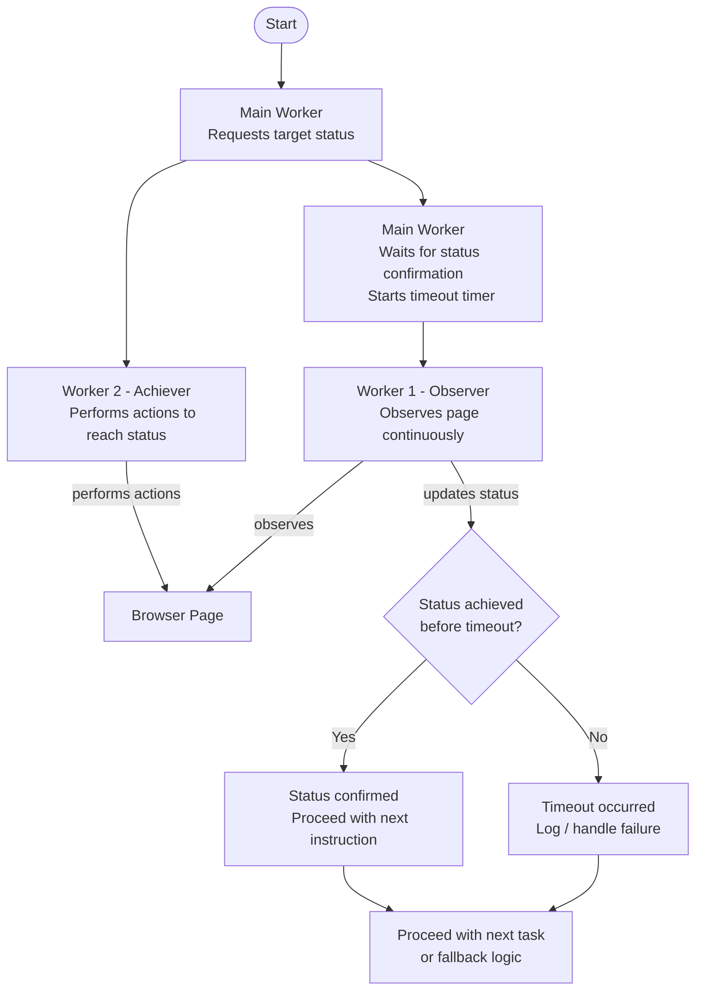
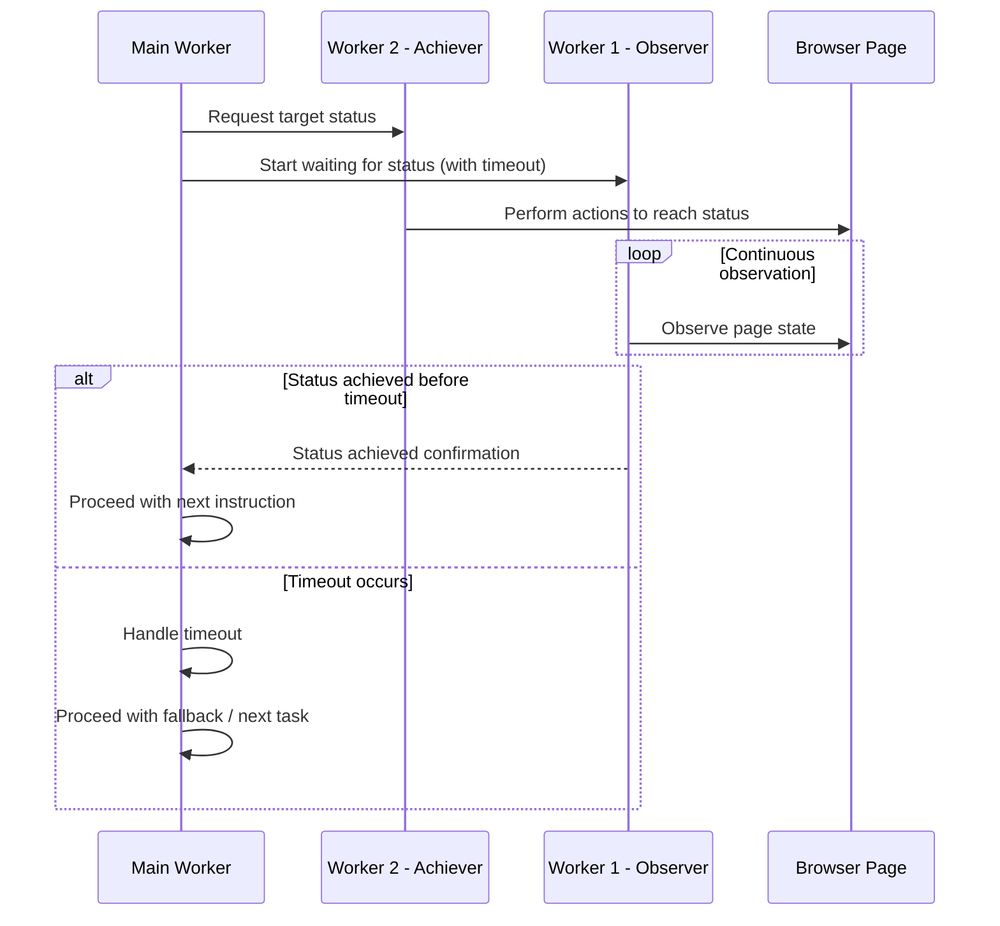

# Browser Operation Architecture

## FLow Chart

```mermaid
flowchart TD
    START([Start])

    MW_REQ[Main Worker
    Requests target status]

    W2_ACT[Worker 2 - Achiever
    Performs actions to reach status]

    MW_WAIT[Main Worker
    Waits for status confirmation
    Starts timeout timer]

    W1_OBS[Worker 1 - Observer
    Observes page continuously]

    CHECK{Status achieved
    before timeout?}

    SUCCESS[Status confirmed
    Proceed with next instruction]

    TIMEOUT[Timeout occurred
    Log / handle failure]

    NEXT[Proceed with next task
    or fallback logic]

    PAGE[Browser Page]

    START --> MW_REQ
    MW_REQ --> W2_ACT
    W2_ACT -->|performs actions| PAGE

    MW_REQ --> MW_WAIT
    MW_WAIT --> W1_OBS
    W1_OBS -->|observes| PAGE
    W1_OBS -->|updates status| CHECK

    CHECK -->|Yes| SUCCESS
    CHECK -->|No| TIMEOUT

    SUCCESS --> NEXT
    TIMEOUT --> NEXT
```
## Sequence diagram

```mermaid
sequenceDiagram
    participant MW as Main Worker
    participant W2 as Worker 2 - Achiever
    participant W1 as Worker 1 - Observer
    participant PG as Browser Page

    MW->>W2: Request target status
    MW->>W1: Start waiting for status (with timeout)

    W2->>PG: Perform actions to reach status
    loop Continuous observation
        W1->>PG: Observe page state
    end

    alt Status achieved before timeout
        W1-->>MW: Status achieved confirmation
        MW->>MW: Proceed with next instruction
    else Timeout occurs
        MW->>MW: Handle timeout
        MW->>MW: Proceed with fallback / next task
    end
```