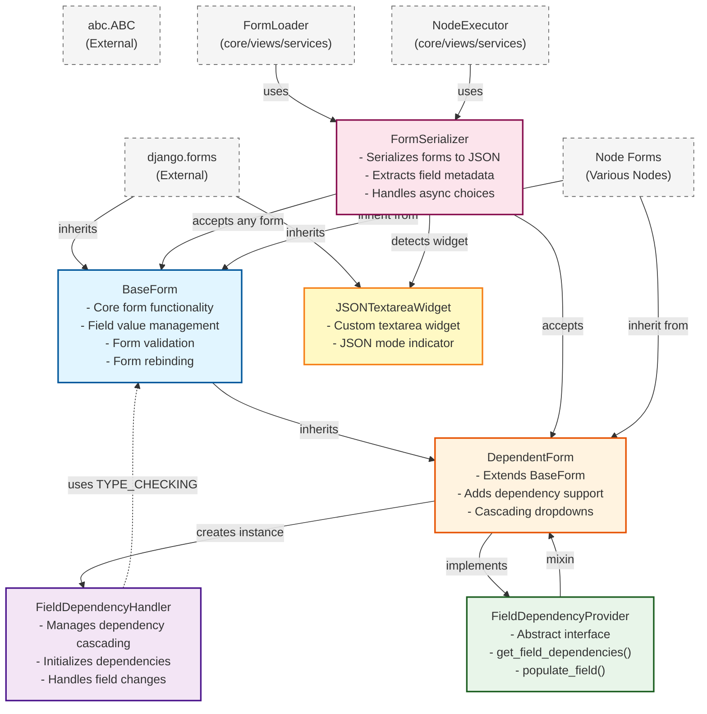

# Class Relationships



- **Metaclass:** Metaclasses are classes for classes. Just as a class defines how objects behave, a metaclass defines how a class itself is created and behaves.

- `from django.forms.forms import DeclarativeFieldsMetaclass`  :  Without this metaclass, Django forms **would not know which attributes are fields**. In short: **This metaclass turns class attributes into form fields.**

  ### Its core job

  When you write:

  ```python
  class MyForm(forms.Form):
      name = forms.CharField()
      age = forms.IntegerField()
  ```

  `DeclarativeFieldsMetaclass`:

  1. **Intercepts class creation**

  2. Finds all class attributes that are instances of `Field`

  3. Removes them from the class namespace

  4. Collects them into:

     ```python
     MyForm.base_fields
     ```

  5. Preserves **field declaration order**

  6. Handles inheritance (parent form fields + child fields)

     

- `from abc import ABCMeta` : It enforces **abstract methods**

  

- ```python
  class FormABCMeta(DeclarativeFieldsMetaclass, ABCMeta):
      """Metaclass that combines Django's form metaclass with ABCMeta."""
      pass
  ```

  `FormABCMeta` This creates a **hybrid metaclass** that does **both**:

  | Feature                  | Provided by                  |
  | ------------------------ | ---------------------------- |
  | Collect form fields      | `DeclarativeFieldsMetaclass` |
  | Enforce abstract methods | `ABCMeta`                    |

  

- ## What does this enable in practice?

  It allows you to define **abstract Django forms**.

  ### Example usage

  ```python
  from abc import abstractmethod
  from django import forms
  
  class BaseForm(forms.Form, metaclass=FormABCMeta):
  
      name = forms.CharField()
  
      @abstractmethod
      def save(self):
          pass
  ```

  Now:

  ```python
  BaseForm()  
  # ❌ TypeError: Can't instantiate abstract class BaseForm
  ```

  ### Correct subclass

  ```python
  class UserForm(BaseForm):
  
      email = forms.EmailField()
  
      def save(self):
          print("Saving user")
  UserForm()  
  # ✅ Works
  ```

