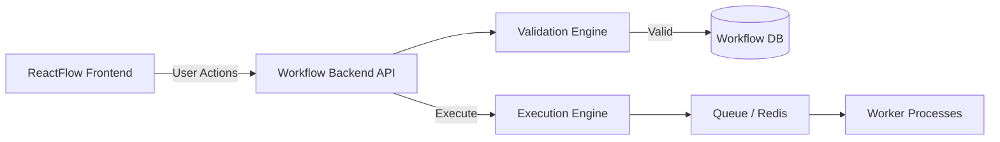
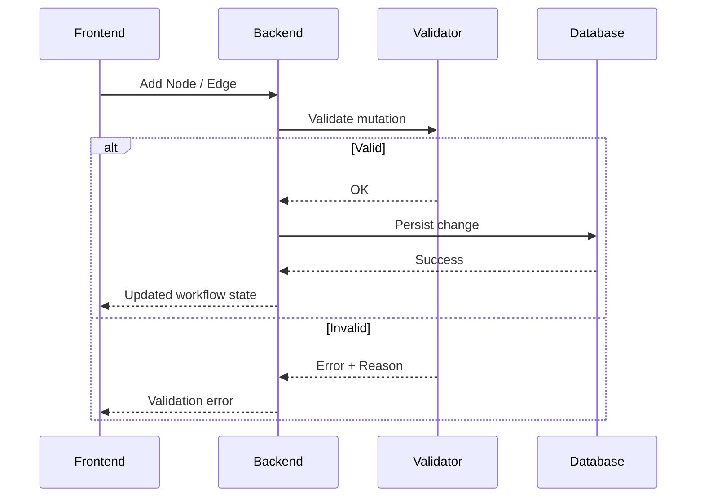
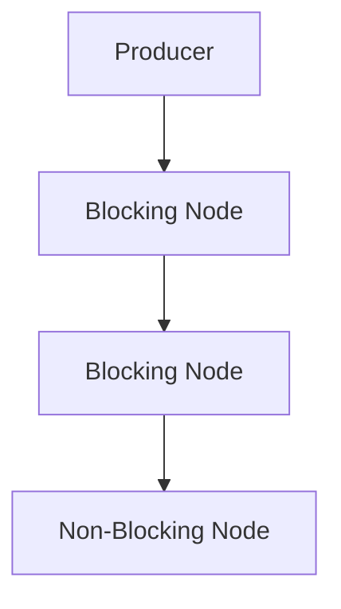
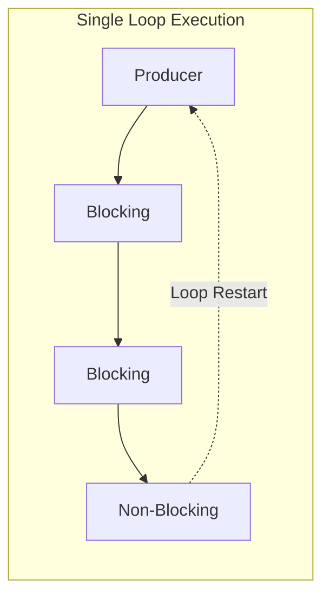
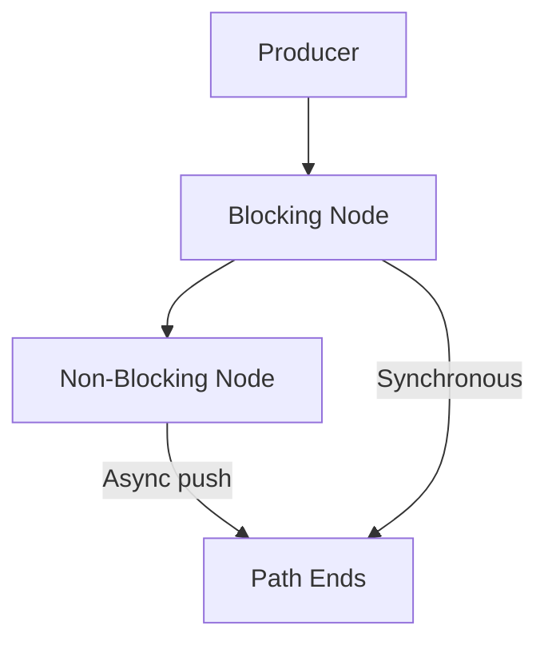
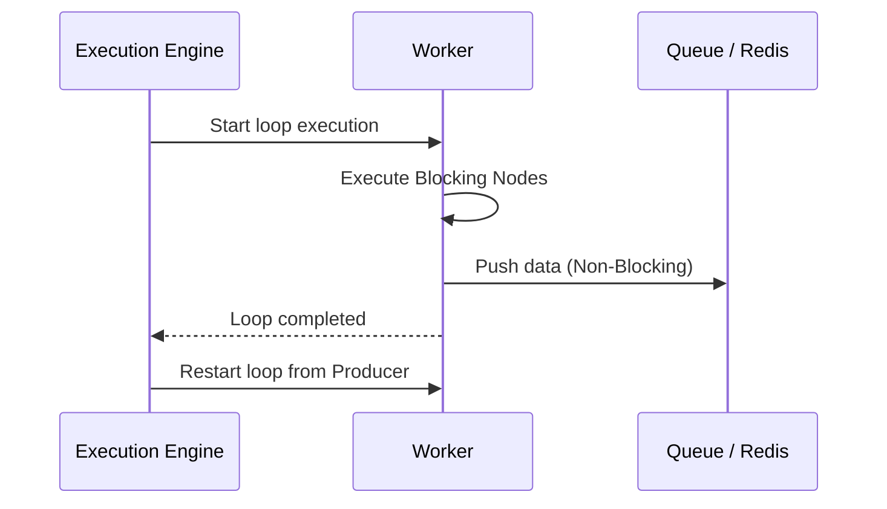
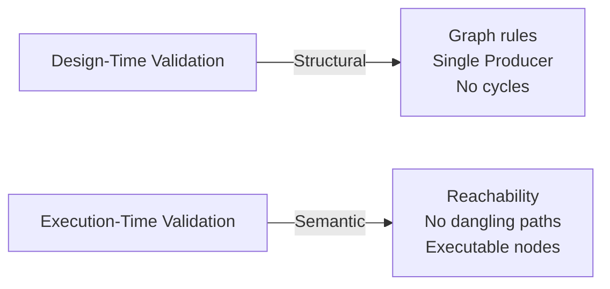
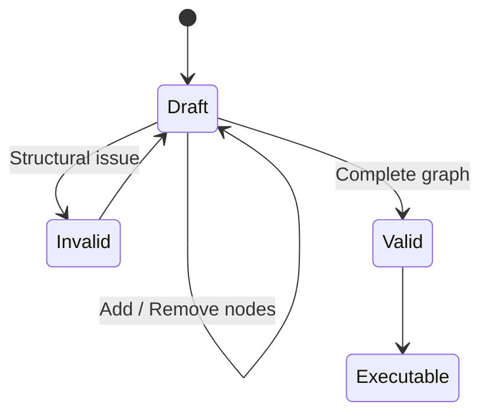
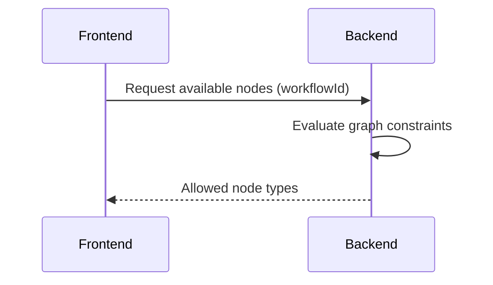
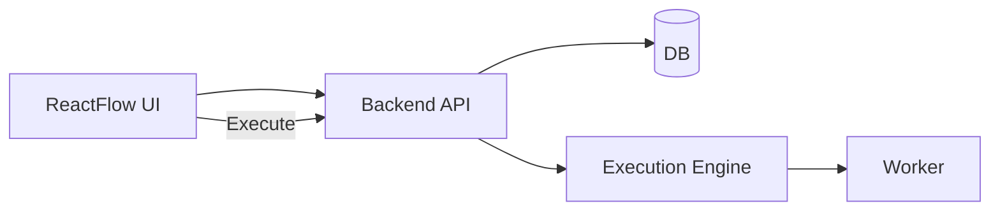

Below are **multiple Mermaid diagrams** that together explain the Workflow Engine **end-to-end** — design time, runtime, validation, looping, and frontend–backend interaction.
Each diagram focuses on **one architectural concern**, so reviewers can reason about the system in layers.

---

## 1. High-Level System Architecture

**Purpose:** Shows major components and responsibility boundaries.

**Key Takeaway:**
Frontend never decides correctness. Backend validates, persists, and executes.

---

## 2. Design-Time Interaction Flow (Single Source of Truth)

**Purpose:** Explains incremental validation and persistence.

**Key Takeaway:**
Invalid workflow states are **never stored**.

---

## 3. Workflow Graph Model (Strict DAG)

**Purpose:** Shows that the workflow graph itself is always acyclic.

**Key Takeaway:**
There is **no cycle in the graph** — loops are not graph edges.

---

## 4. Loop Execution Model (Critical Concept)

**Purpose:** Demonstrates how loops work without graph cycles.

**Key Takeaway:**
Loop restart is an **execution jump**, not a graph connection.

---

## 5. Blocking vs Non-Blocking Semantics

**Purpose:** Explains execution path termination.

**Key Takeaway:**
Non-blocking nodes **terminate the current execution path**.

---

## 6. Execution Engine Runtime Flow

**Purpose:** Shows what happens during execution.

**Key Takeaway:**
Each loop iteration is isolated and deterministic.

---

## 7. Design-Time vs Execution-Time Validation

**Purpose:** Clarifies validation responsibilities.

**Key Takeaway:**
Design-time ≠ execution-time. Both are mandatory.

---

## 8. Incomplete Workflow Lifecycle

**Purpose:** Shows how incomplete workflows are allowed but blocked from execution.

**Key Takeaway:**
Incomplete workflows are **saveable**, not **runnable**.

---

## 9. Node Availability Resolution (Dynamic UI)

**Purpose:** Explains backend-driven UI behavior.

**Example Rule Encoded in Backend:**

* Producer exists → Producer hidden
* Producer deleted → Producer allowed

---

## 10. End-to-End Execution View

**Purpose:** Full mental model from design to execution.

**Key Takeaway:**
Design and execution are cleanly separated but fully consistent.

---

## Final Mental Model

* **Graph = structure**
* **Loop = execution behavior**
* **Backend = authority**
* **Frontend = intent capture**
* **Validation = layered safety**
* **Execution = deterministic and isolated**