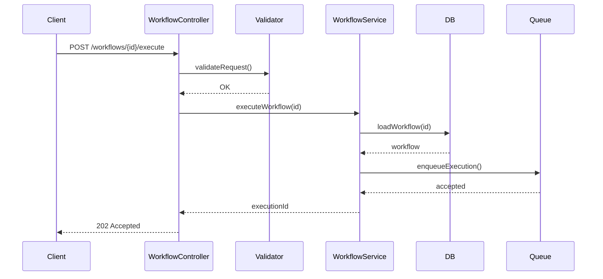
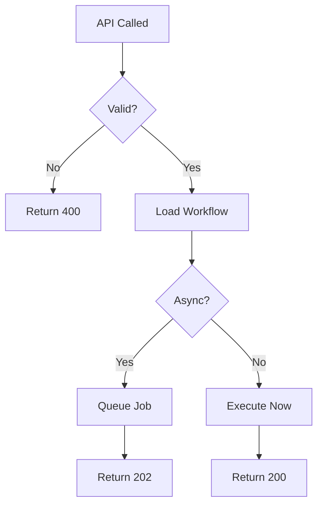
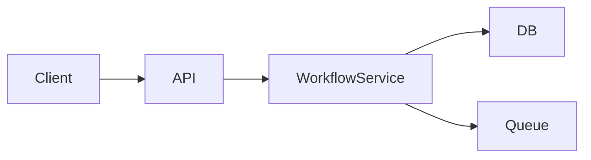

For an **API endpoint**, the **best way to define its functionality** depends on *how deep* you want to go. Below is the **industry-standard, backend-architect–approved approach**, using **UML + Mermaid**, kept practical and not academic.

---

## ✅ The BEST way (clear + complete)

> **Use a combination of:**
>
> 1. **Sequence Diagram** → endpoint behavior
> 2. **Class Diagram (or Interface view)** → endpoint contract
> 3. *(Optional)* **Activity Diagram** → internal logic

If you must choose **only one**, choose a **Sequence Diagram**.

---

## 1️⃣ Sequence Diagram — ⭐ BEST for API Endpoint Functionality

### What it answers

> “What exactly happens when this API endpoint is called?”

### What it shows

* Request flow
* Validation
* Service calls
* DB / Queue / External calls
* Sync vs async
* Error handling

### Mermaid example (recommended)



### Why this is best

✔ Explains runtime behavior
✔ Easy for backend + frontend + QA
✔ Matches how APIs actually work

---

## 2️⃣ Class Diagram — BEST for API Contract

### What it answers

> “What does this endpoint accept and return?”

### What it shows

* Endpoint method
* Request DTO
* Response DTO
* Status codes

### UML-style view (conceptual)

```text
+---------------------+
| WorkflowController  |
+---------------------+
| +execute(id): Response |
+---------------------+

ExecuteRequest
- runMode
- inputs

ExecuteResponse
- executionId
- status
```

### When to use

✔ API documentation
✔ Contract-first design
✔ Swagger/OpenAPI alignment

---

## 3️⃣ Activity Diagram — Internal Endpoint Logic (Optional)

### What it answers

> “What decisions happen inside the endpoint?”

Use this **only if logic is complex** (branching, retries, loops).



---

## 4️⃣ Component Diagram — Ownership (Optional but clean)

Use when multiple services are involved.



---
